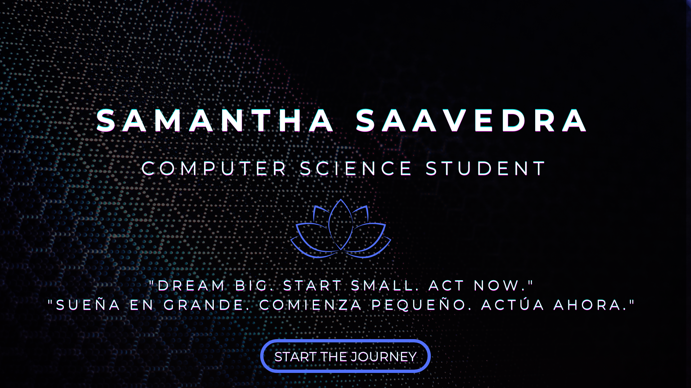

  

###

	
	  

###

<h3 align="left">Connect with me:</h3>

###

  
  
  

###

<h3 align="left">💫 About Me:</h3>

###

👩â€ğŸ’» I’m a Computer Science student passionate about Python, data science, and machine learning, competitive programming and algorithms.  🔠Interested in research related to computer science and machine learning.  📚 Committed to lifelong learning, continuously growing and evolving.  💬 Ask me about programming, data science, and AI!  📫 Reach me: samanthasaavedra.dev@gmail.com  🖥 Fun fact: I love exploring new tech and solving complex problems!

###

###

<h3 align="left">Languages:</h3>

###

  
  
  
  
  
  
  
  
  
  
  
  
  
  
  

###

  
  

###
